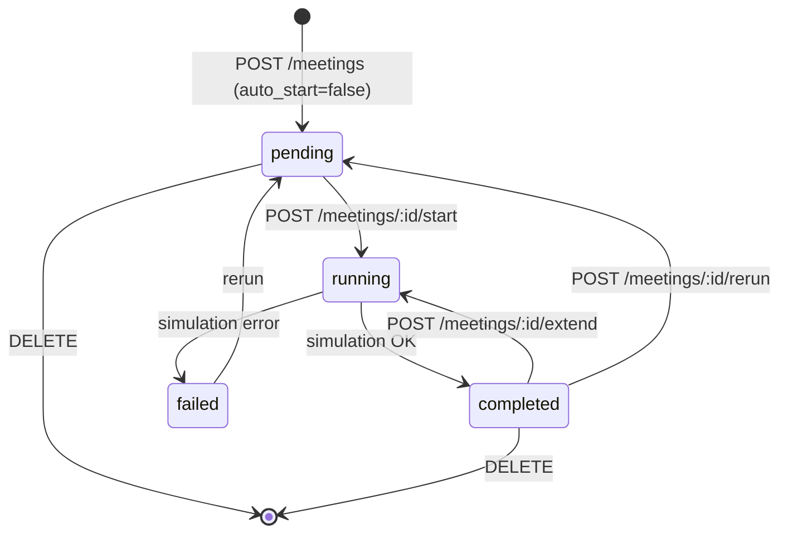
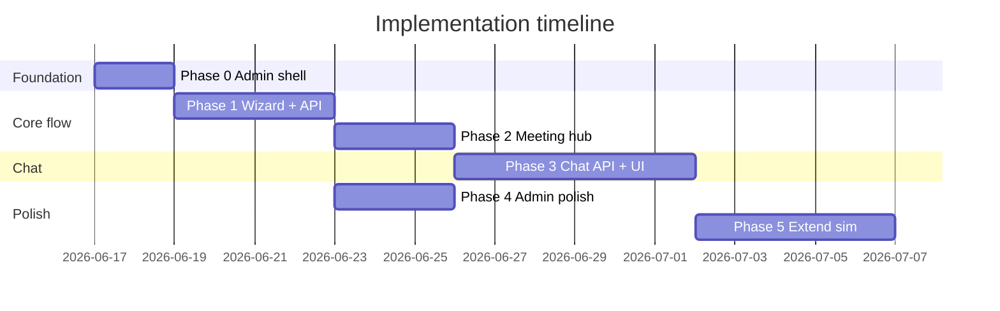

# Implementation Plan — Admin / Meeting Wizard / Simulation / Chat

Tài liệu này mô tả kế hoạch triển khai theo từng phase cho yêu cầu:

1. **Quản trị** — CRUD persona, company profile, danh sách meeting
2. **Tạo meeting** — wizard nhiều bước (topic, lịch, ghi chú, persona, chủ trì)
3. **Simulation** — chạy sau khi tạo, xem transcript + insight report
4. **Chat** — chat 1-1 với persona sau meeting, xem lại và tiếp tục
5. **Extend** — facilitator bổ sung nội dung sau `completed`; resume simulation nếu đủ ý nghĩa (Upgrade 2)

---

## 1. Mục tiêu & phạm vi

### 1.1 Mục tiêu sản phẩm

| Vùng | Mục tiêu |
|------|----------|
| Admin | Tách khỏi workspace; quản lý dữ liệu nền (persona, company, meetings) |
| Workspace | Luồng nghiệp vụ: tạo meeting → chạy sim → chat follow-up → (optional) extend sim |
| Meeting lifecycle | Tạo trước, chạy simulation sau (không auto-start) |
| Chat | Persist lịch sử chat theo `(meeting_id, persona_id)` |

### 1.2 Ngoài phạm vi (phase này)

- Authentication / RBAC
- Group chat nhiều persona trong một thread (chat UI tự do)
- Cancel/pause simulation đang chạy
- Hard delete persona (giữ soft deactivate)
- Mobile-native app

### 1.3 Hiện trạng codebase (baseline)

| Thành phần | Trạng thái |
|------------|------------|
| Persona CRUD API + UI | ✅ `/personas`, `/personas/:role` |
| Company profile API + UI | ✅ `/settings/company` |
| Meeting list + delete | ✅ `/` (HomePage) |
| Tạo meeting | ⚠️ Một form, **auto-start** sim (`POST /meetings` → `start_meeting_simulation`) |
| Simulation SSE + insight | ✅ `/meetings/:id` + `useMeetingStream` |
| Private chat | ⚠️ Library only (`sim_chat/private_chat.py`), không API/UI |
| `scheduled_at`, `host_id` | ❌ Chưa có trong DB |
| Chat persistence | ❌ |

**File tham chiếu chính:**

```
backend/app/db/models.py
backend/app/schemas/meeting.py
backend/app/services/meeting_service.py
backend/app/api/meetings.py          # create auto-starts sim (line 68-69)
sim_chat/private_chat.py
frontend/src/App.tsx
frontend/src/components/Layout.tsx
frontend/src/pages/NewMeetingPage.tsx
frontend/src/pages/MeetingPage.tsx
```

---

## 2. Kiến trúc mục tiêu

### 2.1 Route map

```
WORKSPACE                          ADMIN
/                                  /admin/personas
/meetings/new                      /admin/personas/new | :role
/meetings/:id                      /admin/company
  ?tab=overview | simulation | chat /admin/meetings
```

Redirect tương thích ngược:

| Route cũ | Route mới |
|----------|-----------|
| `/personas` | `/admin/personas` |
| `/personas/new`, `/personas/:role` | `/admin/personas/...` |
| `/settings/company` | `/admin/company` |

### 2.2 Meeting lifecycle



- **`completed → running` (extend)**: facilitator bổ sung directive có ý nghĩa; graph resume từ `MeetingRecord`. Chi tiết: [`IMPLEMENTATION_UPGRADE_2_PLAN.md`](IMPLEMENTATION_UPGRADE_2_PLAN.md).

- **`pending`**: meeting đã tạo, chưa chạy simulation (thay cho “draft” riêng — tái sử dụng enum hiện có).
- **`running` / `completed` / `failed`**: giữ nguyên semantics hiện tại.

### 2.3 Data model bổ sung

#### Migration `003_meeting_metadata`

Bảng `meetings`:

| Cột | Kiểu | Mô tả |
|-----|------|-------|
| `scheduled_at` | `TIMESTAMPTZ NULL` | Ngày giờ dự kiến họp |
| `host_id` | `VARCHAR(64) NULL` | Role persona chủ trì; FK logic → `personas.role` |
| `notes` | `TEXT NOT NULL DEFAULT ''` | Ghi chú bổ sung (tách khỏi `opening_message` nếu cần) |

**Quy ước field:**

- `opening_message` — lời mở đầu / mandate gửi vào simulation (CEO mandate).
- `notes` — metadata nội bộ, hiển thị trên Overview, **không** bắt buộc đưa vào sim trừ khi config bật.

`config` JSONB bổ sung:

```json
{
  "host_id": "CEO",
  "opening_speaker": "CEO"
}
```

#### Migration `004_chat_sessions`

```sql
chat_sessions (
  id              UUID PK,
  meeting_id      VARCHAR(36) FK → meetings.id ON DELETE CASCADE,
  persona_id      VARCHAR(64) NOT NULL,
  created_at      TIMESTAMPTZ,
  updated_at      TIMESTAMPTZ,
  UNIQUE (meeting_id, persona_id)
)

chat_messages (
  id              UUID PK,
  session_id      UUID FK → chat_sessions.id ON DELETE CASCADE,
  role            VARCHAR(16)  -- 'user' | 'assistant'
  content         TEXT,
  created_at      TIMESTAMPTZ
)
```

---

## 3. Tổng quan các phase

| Phase | Tên | Mục tiêu | Phụ thuộc | Effort |
|-------|-----|----------|-----------|--------|
| **0** | Admin shell & routing | Tách UI quản trị khỏi workspace | — | S |
| **1** | Meeting metadata & wizard | Tạo meeting không auto-run; host, lịch, ghi chú | Phase 0 (UI) | M |
| **2** | Meeting hub (3 tabs) | Overview / Simulation / Chat placeholder | Phase 1 | M |
| **3** | Post-meeting chat | API + persist + UI chat persona | Phase 2 | L |
| **4** | Admin polish | Bảng quản trị meeting, sửa draft, prompt preview | Phase 0–1 | M |
| **5** | Facilitator extension | Resume sim sau `completed` + significance gate + UI composer | Phase 2–3 | M |

**Effort:** S ≈ 1–2 ngày, M ≈ 3–5 ngày, L ≈ 5–8 ngày (1 dev full-stack).

Phase 5 chi tiết engine/API/UI: [`IMPLEMENTATION_UPGRADE_2_PLAN.md`](IMPLEMENTATION_UPGRADE_2_PLAN.md).

---

## Phase 0 — Admin Shell & Routing

### Mục tiêu

Tách mental model **Workspace** vs **Admin**; di chuyển route quản trị; giữ backward-compatible redirects.

### Deliverables

- [ ] `WorkspaceLayout` — nav: Meetings, New meeting
- [ ] `AdminLayout` — sidebar: Personas, Company, All meetings
- [ ] Header toggle Workspace ↔ Admin
- [ ] Route mới + redirect từ route cũ
- [ ] Cập nhật internal links trong toàn bộ frontend

### Tasks

#### Frontend

| Task | File |
|------|------|
| Tạo `WorkspaceLayout.tsx` | `frontend/src/components/WorkspaceLayout.tsx` |
| Tạo `AdminLayout.tsx` | `frontend/src/components/AdminLayout.tsx` |
| Refactor hoặc deprecate `Layout.tsx` | `frontend/src/components/Layout.tsx` |
| Cập nhật routes | `frontend/src/App.tsx` |
| Wrap pages: Home, NewMeeting, Meeting → WorkspaceLayout | `frontend/src/pages/*.tsx` |
| Wrap: Personas, PersonaEdit, Company → AdminLayout | `frontend/src/pages/*.tsx` |
| Thêm `AdminMeetingsPage` (copy/list từ HomePage, bảng đầy đủ hơn — có thể stub Phase 4) | `frontend/src/pages/admin/AdminMeetingsPage.tsx` |

#### Backend

Không thay đổi API trong phase này.

### Acceptance criteria

- [ ] `/admin/personas` hiển thị danh sách persona (chức năng giống `/personas` cũ)
- [ ] `/admin/company` chỉnh sửa company profile
- [ ] `/` chỉ còn nav workspace (không còn link Personas/Company trực tiếp)
- [ ] `/personas`, `/settings/company` redirect 301/ `<Navigate>` sang admin routes
- [ ] Không regression: create persona, edit company, list meetings vẫn hoạt động

### Testing

- Manual: click-through toàn bộ nav cũ (bookmark) → đúng trang mới
- Optional: React Router test cho redirects

---

## Phase 1 — Meeting Metadata & Creation Wizard

### Mục tiêu

- Meeting được **tạo trước**, simulation **chạy sau** (explicit action).
- Wizard 3 bước: thông tin cơ bản → thành phần → xác nhận.
- Lưu `scheduled_at`, `host_id`, `notes`.

### Deliverables

- [ ] Alembic migration `003_meeting_metadata`
- [ ] API: `auto_start` trên create; `PATCH /meetings/:id`; mở rộng response/list schemas
- [ ] Frontend wizard thay thế `NewMeetingPage` single-form
- [ ] Meeting Overview hiển thị metadata + nút **Chạy simulation**

### Tasks

#### Backend — Database

| Task | File |
|------|------|
| Migration thêm cột | `backend/alembic/versions/003_meeting_metadata.py` |
| Cập nhật ORM | `backend/app/db/models.py` |

#### Backend — Schemas & Service

| Task | Chi tiết |
|------|----------|
| `CreateMeetingRequest` | Thêm `scheduled_at`, `host_id`, `notes`, `auto_start: bool = False` |
| `UpdateMeetingRequest` | Mới: patch topic/notes/scheduled_at/participants/host (chỉ khi `status=pending`) |
| `MeetingResponse`, `MeetingListItem` | Thêm fields mới |
| Validation | `host_id` ∈ `participant_ids`; host phải là active persona |
| `create_meeting` | Set `status=PENDING`; **không** gọi simulation |
| `_build_config_from_payload` | Ghi `host_id`, map `opening_speaker` = host cho sim |
| `update_meeting` | Mới trong `meeting_service.py` |

#### Backend — API

| Endpoint | Thay đổi |
|----------|----------|
| `POST /meetings` | Chỉ gọi `start_meeting_simulation` khi `auto_start=true` (default `false`) |
| `PATCH /meetings/:id` | Mới — edit pending meeting |
| `POST /meetings/:id/start` | Giữ nguyên; validate `pending` |

File: `backend/app/api/meetings.py`, `backend/app/schemas/meeting.py`

#### Frontend

| Task | File |
|------|------|
| Types mới | `frontend/src/types.ts` |
| API client | `frontend/src/api/client.ts` — `updateMeeting`, payload fields |
| Wizard component | `frontend/src/components/meeting/MeetingWizard.tsx` |
| Step 1: BasicInfoStep | topic, scheduled_at (date + time), notes |
| Step 2: ParticipantsStep | checkbox personas + radio host |
| Step 3: ConfirmStep | summary + advanced (LLM, max_turns) collapsed |
| Refactor page | `frontend/src/pages/NewMeetingPage.tsx` |
| Sau submit | Navigate `/meetings/:id?tab=overview` (không auto stream) |

#### Simulation engine (optional trong phase 1)

| Task | File |
|------|------|
| Đọc `host_id` / `opening_speaker` từ config | `sim_chat/config.py`, `sim_chat/graph.py` |

Chỉ cần nếu sim hiện không tôn trọng opening speaker từ config.

### Acceptance criteria

- [ ] `POST /meetings` với `auto_start=false` → `status=pending`, không có active run
- [ ] `POST /meetings/:id/start` → simulation chạy, SSE hoạt động
- [ ] Wizard validate: topic required, ≥1 participant, host ∈ participants
- [ ] `PATCH` bị từ chối (400) khi meeting `running` hoặc `completed`
- [ ] `MeetingListItem` hiển thị `scheduled_at`, `host_id` trên card (optional badge)
- [ ] Backward compat: `POST /meetings` với `auto_start=true` vẫn hoạt động như cũ (cho script/test)

### Testing

| Layer | Test |
|-------|------|
| Backend | Unit: validation host_id; create không start; patch pending |
| Backend | Integration: create → start → completed |
| Frontend | Manual wizard flow; error states |

---

## Phase 2 — Meeting Hub (3 Tabs)

### Mục tiêu

Refactor `/meetings/:id` thành hub với 3 tab: **Tổng quan**, **Simulation**, **Chat** (placeholder disabled cho phase 3).

### Deliverables

- [ ] `MeetingHubPage` với tab navigation
- [ ] `MeetingOverviewTab` — metadata, participants, host badge, CTA theo status
- [ ] `MeetingSimulationTab` — extract logic từ `MeetingPage` hiện tại
- [ ] `MeetingChatTab` — empty state “Cần hoàn thành simulation trước”
- [ ] Status-driven enable/disable tabs

### Tasks

#### Frontend — Structure

```
frontend/src/pages/meeting/
  MeetingHubPage.tsx
  MeetingOverviewTab.tsx
  MeetingSimulationTab.tsx
  MeetingChatTab.tsx      # stub phase 2, implement phase 3
frontend/src/components/meeting/
  MeetingHeader.tsx       # topic, status, scheduled, host
  MeetingTabNav.tsx
  ParticipantChips.tsx
  RunSimulationButton.tsx
```

| Task | Chi tiết |
|------|----------|
| Route | `/meetings/:id` → `MeetingHubPage`; tab qua `?tab=` hoặc nested routes |
| Extract | `TranscriptView`, `InsightView`, `useMeetingStream` → Simulation tab |
| Overview actions | pending → “Chạy simulation”; completed → links to sim/chat tabs |
| Rerun modal | Di chuyển từ MeetingPage sang Simulation tab |
| Delete meeting | Overview tab hoặc header menu |

#### Frontend — Routing option (khuyến nghị)

Nested routes:

```
/meetings/:id              → redirect /meetings/:id/overview
/meetings/:id/overview
/meetings/:id/simulation
/meetings/:id/chat
```

### Tab behavior matrix

| Status | Overview | Simulation | Chat |
|--------|----------|------------|------|
| `pending` | ✅ Edit metadata (phase 4), Run sim | Disabled / “Chưa chạy” | Disabled |
| `running` | ✅ Status live | ✅ SSE stream | Disabled |
| `completed` | ✅ Summary | ✅ Transcript + insight + facilitator composer (phase 5) | ✅ Enabled (phase 3) |
| `failed` | ✅ Error + Rerun | ✅ Error detail | Disabled |

Khi **extend** đang chạy (`completed → running`): Simulation tab SSE live; Chat tab disabled (giống lần chạy đầu).

### Acceptance criteria

- [ ] Completed meeting: xem lại transcript + insight giống behavior cũ
- [ ] Running meeting: SSE live trên tab Simulation
- [ ] Pending meeting: không gọi `/stream` (tránh 400)
- [ ] URL bookmark tab simulation/chat hoạt động
- [ ] Xóa `MeetingPage.tsx` monolith hoặc re-export hub

### Testing

- Manual: pending → start → running → completed flow qua tabs
- Regression: rerun, delete từ hub

---

## Phase 3 — Post-Meeting Chat (API + UI)

### Mục tiêu

Chat 1-1 với persona sau meeting completed; persist lịch sử; tiếp tục chat khi quay lại.

### Deliverables

- [ ] Migration `004_chat_sessions`
- [ ] `chat_service.py` wrap `sim_chat/private_chat.py`
- [ ] REST API chat sessions & messages
- [ ] `MeetingChatTab` full UI
- [ ] API client + types frontend

### Tasks

#### Backend — Database & Models

| File | Nội dung |
|------|----------|
| `backend/alembic/versions/004_chat_sessions.py` | Tables above |
| `backend/app/db/models.py` | `ChatSession`, `ChatMessage` |
| `backend/app/schemas/chat.py` | Request/response DTOs |

#### Backend — Service

File: `backend/app/services/chat_service.py`

| Function | Mô tả |
|----------|-------|
| `list_sessions(meeting_id)` | Sessions theo meeting |
| `get_or_create_session(meeting_id, persona_id)` | Lazy create; build prompt từ `Meeting.record` + persona `system_prompt` |
| `list_messages(session_id)` | Lịch sử ordered by `created_at` |
| `send_message(session_id, content)` | Gọi `PrivateChatSession.chat()`; persist user + assistant messages |

**Preconditions:**

- Meeting `status == completed`
- `persona_id` ∈ `meeting.participant_ids`
- `meeting.record` not null

**LLM config:** reuse `meeting.config` (`llm_provider`, `llm_model`, `use_mock`).

Wrapper:

```python
from sim_chat.private_chat import create_session_from_record
# Hydrate MeetingRecord from meeting.record JSON
# Load persona prompts via prompt_service
```

#### Backend — API

File: `backend/app/api/chat.py` — mount tại `/meetings/{meeting_id}/chat`

| Method | Path | Mô tả |
|--------|------|-------|
| GET | `/meetings/:id/chat/sessions` | List sessions + last message preview |
| POST | `/meetings/:id/chat/sessions` | Body: `{ persona_id }` → create/get session |
| GET | `/meetings/:id/chat/sessions/:sid/messages` | Message history |
| POST | `/meetings/:id/chat/sessions/:sid/messages` | Body: `{ content }` → `{ user_msg, assistant_msg }` |

Register in `backend/app/api/router.py`.

#### Frontend

| Component | Mô tả |
|-----------|-------|
| `PersonaChatSidebar.tsx` | List participants; badge unread (optional) |
| `ChatMessageList.tsx` | Bubbles user / persona |
| `ChatComposer.tsx` | Input + send; disabled while loading |
| `MeetingChatTab.tsx` | Compose sidebar + thread |
| `useChatSession.ts` | Hook load session, send message, optimistic UI optional |

File: `frontend/src/api/client.ts`, `frontend/src/types.ts`

### Acceptance criteria

- [ ] Chỉ meeting `completed` mới tạo được session
- [ ] Chat persona không tham gia meeting → 400
- [ ] Gửi tin → persona trả lời giữ character (manual QA)
- [ ] Reload trang → lịch sử chat còn nguyên
- [ ] Nhiều persona → mỗi persona một session riêng, switch sidebar không mất history
- [ ] Meeting bị xóa → cascade xóa chat sessions

### Testing

| Layer | Test |
|-------|------|
| Backend | Unit: preconditions; mock LLM reply persisted |
| Backend | Integration: completed meeting → create session → 2 turns → reload messages |
| Frontend | Manual: switch persona, long transcript scroll |

### Performance notes

- `build_private_chat_session` embeds full transcript trong system prompt — chấp nhận được với meeting ngắn; phase sau có thể truncate/summary nếu cần.

---

## Phase 4 — Admin Polish & Draft Editing

### Mục tiêu

Hoàn thiện khu admin; sửa meeting pending; công cụ quản trị bổ sung.

### Deliverables

- [ ] `AdminMeetingsPage` — bảng đầy đủ với filter/search
- [ ] Edit meeting trên Overview tab (pending only)
- [ ] Persona prompt preview panel
- [ ] Rebuild prompts button trên company page
- [ ] (Optional) `POST /admin/seed` button trong admin

### Tasks

#### Admin meetings table

| Cột | Nội dung |
|-----|----------|
| Topic | Link workspace `/meetings/:id` |
| Scheduled | `scheduled_at` |
| Host | Chip |
| Participants | Count / chips |
| Status | Badge |
| Created | `created_at` |
| Actions | Delete, Open |

Filters: status dropdown, search topic (client-side hoặc query param `?status=&q=`).

Backend optional: mở rộng `GET /meetings` với query filters.

#### Edit pending meeting

- UI form trên `MeetingOverviewTab` khi `status=pending`
- Gọi `PATCH /meetings/:id` (đã có từ Phase 1)

#### Persona prompt preview

- Nút “Xem system prompt” trên `PersonaEditPage`
- Gọi `POST /personas/:role/preview-prompt` (API đã có)

#### Company admin

- Banner rebuild + nút `POST /company-profile/rebuild-prompts`

### Acceptance criteria

- [ ] Admin có thể tìm và xóa meeting từ `/admin/meetings`
- [ ] Sửa topic/participants/host trên pending meeting không cần xóa tạo lại
- [ ] Preview prompt hiển thị trước khi save persona
- [ ] Rebuild prompts sau khi sửa company

---

## Phase 5 — Facilitator Extension (Upgrade 2)

### Mục tiêu

Sau khi simulation `completed`, người dùng (facilitator) bổ sung directive trên tab Simulation. Nếu **significance gate** chấp nhận, graph resume trên cùng meeting; persona phản ứng trước nhóm; insight regenerate.

### Deliverables

- [ ] `sim_chat/resume.py` — hydrate state từ `MeetingRecord`
- [ ] `sim_chat/extension.py` — significance classifier
- [ ] Orchestrator + context hỗ trợ `FACILITATOR` turn
- [ ] `POST /meetings/:id/extend` (+ optional `/evaluate`)
- [ ] `FacilitatorComposer` trên `MeetingSimulationTab`
- [ ] Lifecycle `completed → running → completed`

### Tài liệu chi tiết

Toàn bộ spec engine, API, UI, test checklist, rủi ro: **[`IMPLEMENTATION_UPGRADE_2_PLAN.md`](IMPLEMENTATION_UPGRADE_2_PLAN.md)**

### Acceptance criteria (tóm tắt)

- [ ] Directive ngân sách/deadline mới → sim tiếp tục, persona phản hồi
- [ ] Tin filler → 409 + gợi ý; `force: true` override
- [ ] Insight cập nhật sau extend
- [ ] Rerun / chat 1-1 / follow-up meeting không regression

**Phụ thuộc:** Phase 2 (Simulation tab), Phase 3 (phân biệt extend vs chat 1-1). **Effort:** M (~1–2 tuần).

---

## 4. API contract summary (sau tất cả phase)

### Meetings

```http
POST /api/meetings
{
  "topic": "...",
  "opening_message": "...",
  "notes": "...",
  "scheduled_at": "2026-06-17T14:00:00+07:00",
  "participant_ids": ["CEO", "CFO"],
  "host_id": "CEO",
  "max_turns": 25,
  "llm_provider": "openai",
  "llm_model": "gpt-4o-mini",
  "use_mock": false,
  "auto_start": false
}

PATCH /api/meetings/{id}          # pending only
POST  /api/meetings/{id}/start    # pending → running
POST  /api/meetings/{id}/rerun
GET   /api/meetings/{id}/stream
DELETE /api/meetings/{id}
```

### Extend (Phase 5 / Upgrade 2)

```http
POST /api/meetings/{id}/extend/evaluate   { "content": "..." }
POST /api/meetings/{id}/extend            { "content": "...", "force": false }
```

Preconditions: `status == completed`, `record` present, dưới `max_extensions`. Reject insignificant → `409` + suggestion. Accept → `202`, client subscribe `/stream`.

Chi tiết: [`IMPLEMENTATION_UPGRADE_2_PLAN.md`](IMPLEMENTATION_UPGRADE_2_PLAN.md).

### Chat (Phase 3)

```http
GET  /api/meetings/{id}/chat/sessions
POST /api/meetings/{id}/chat/sessions        { "persona_id": "CFO" }
GET  /api/meetings/{id}/chat/sessions/{sid}/messages
POST /api/meetings/{id}/chat/sessions/{sid}/messages   { "content": "..." }
```

---

## 5. Thứ tự triển khai & merge strategy



**Khuyến nghị branch:**

| Branch | Phase |
|--------|-------|
| `feat/admin-shell` | 0 |
| `feat/meeting-wizard` | 1 |
| `feat/meeting-hub` | 2 |
| `feat/post-meeting-chat` | 3 |
| `feat/admin-polish` | 4 (có thể song song sau phase 1) |
| `feat/meeting-extension` | 5 |

Merge tuần tự 0 → 1 → 2 → 3 → 5; phase 4 có thể tách PR nhỏ independent.

---

## 6. Rủi ro & giảm thiểu

| Rủi ro | Impact | Giảm thiểu |
|--------|--------|------------|
| Breaking `POST /meetings` auto-start | Script/test cũ fail | Default `auto_start=false`; document migration; test cập nhật |
| Chat prompt quá dài (full transcript) | LLM cost/latency | Truncate transcript trong `build_private_chat_session` nếu > N tokens |
| SSE race khi chuyển tab | Duplicate events | `useMeetingStream` cleanup on unmount; single subscription per tab |
| Không có auth | Admin exposed | Ghi rõ out-of-scope; deploy internal network hoặc phase 5 auth |

---

## 7. Definition of Done (toàn project)

- [ ] Admin tách biệt: persona, company, meetings list
- [ ] Wizard tạo meeting 3 bước với host + scheduled_at + notes
- [ ] Simulation chạy explicit sau khi tạo
- [ ] Meeting hub: overview / simulation / chat tabs
- [ ] Chat 1-1 persona persist, xem lại và tiếp tục
- [ ] Alembic migrations applied (`003`, `004`)
- [ ] README cập nhật hướng dẫn flow mới
- [ ] Manual test checklist passed (mục 8)

---

## 8. Manual test checklist

### Admin
- [ ] Tạo persona mới, sửa, deactivate
- [ ] Sửa company profile, rebuild prompts
- [ ] Xem danh sách meeting tại `/admin/meetings`

### Meeting lifecycle
- [ ] Wizard tạo meeting → pending, không sim
- [ ] Overview → Chạy simulation → transcript live
- [ ] Insight report hiển thị khi completed
- [ ] Rerun với LLM khác
- [ ] Xóa meeting

### Chat
- [ ] Tab chat disabled khi pending/running
- [ ] Chọn CFO → chat 3 câu → reload → history còn
- [ ] Switch sang CEO → session riêng
- [ ] Meeting cũ mở lại → tiếp tục chat

### Extend (Phase 5)
- [ ] Completed → facilitator bổ sung ngân sách mới → sim tiếp tục
- [ ] Tin filler → reject + gợi ý; `force` vẫn chạy
- [ ] Insight cập nhật sau extend
- [ ] Rerun / chat 1-1 không regression

---

## 9. Tài liệu liên quan

- Thiết kế UI chi tiết: thảo luận trong chat (IA, wireframe, tab matrix)
- Simulation engine: [`sim_chat/README.md`](../sim_chat/README.md) · kiến trúc đầy đủ [`sim_chat/docs/architecture.md`](../sim_chat/docs/architecture.md) (multi-domain)
- Upgrade 2 — facilitator extension: [`IMPLEMENTATION_UPGRADE_2_PLAN.md`](IMPLEMENTATION_UPGRADE_2_PLAN.md)
- Upgrade 1 — multi-stage reasoning: [`IMPLEMENTATION_UPGRADE_1_PLAN.md`](IMPLEMENTATION_UPGRADE_1_PLAN.md)
- Seed flow: `scripts/seed.py`, `backend/scripts/seed_db.py`

---

## 10. Addendum — trạng thái triển khai (2026-06-19)

| Phase | Trạng thái |
|-------|------------|
| 0 Admin shell | ✅ |
| 1 Meeting wizard + metadata | ✅ |
| 2 Meeting hub (3 tabs) | ✅ |
| 3 Post-meeting chat | ✅ |
| 4 Admin polish | ⚠️ một phần |
| 5 Facilitator extension | ⚠️ Phase A–B done (engine + API); Phase C UI pending |

---

*Cập nhật lần cuối: 2026-06-19*
