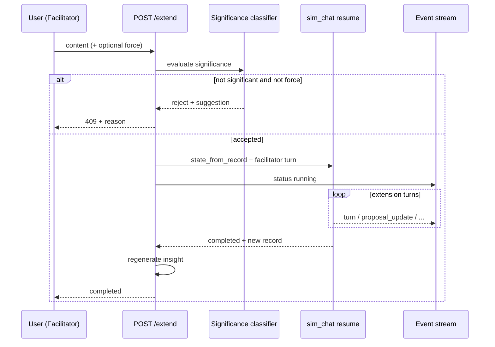
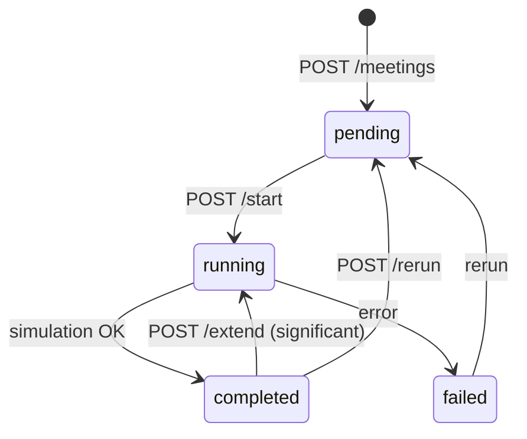

# Implementation Plan — Upgrade 2: Post-Meeting Facilitator Extension

Tài liệu này mô tả kế hoạch triển khai tính năng **mở rộng cuộc họp sau khi simulation đã hoàn thành**: người dùng (vai trò người tổ chức / facilitator) bổ sung nội dung; nếu đánh giá là **đủ ý nghĩa**, simulation nhóm tiếp tục trên cùng meeting với ngữ cảnh đã tích lũy.

**Phân biệt với các luồng hiện có:**

| Luồng | Mục đích |
|-------|----------|
| **Rerun** | Chạy lại từ đầu, xóa transcript + insight |
| **Chat 1-1** | Hỏi sâu **một persona**, không kích hoạt graph nhóm |
| **Meeting tiếp theo** | Tạo meeting **mới** từ insight “Đề xuất bước tiếp theo” |
| **Extend (Upgrade 2)** | Can thiệp facilitator → **cả nhóm phản ứng** trên cùng transcript |

---

## 1. Mục tiêu & phạm vi

### 1.1 Mục tiêu sản phẩm

| Vấn đề hiện tại | Mục tiêu sau nâng cấp |
|------------------|------------------------|
| Meeting kết thúc là “đóng băng” — muốn bổ sung ràng buộc mới phải rerun hoặc tạo meeting mới | Facilitator inject directive sau `completed`; persona tiếp tục tranh luận |
| Chat 1-1 không mô phỏng phản ứng chéo giữa các phe | Resume LangGraph với state hydrate từ `MeetingRecord` |
| Mọi tin nhắn user đều trigger LLM đắt | **Significance gate** — chỉ resume khi nội dung thay đổi debate |

### 1.2 Ngoài phạm vi (upgrade này)

- User đăng nhập / phân quyền facilitator (giữ implicit: ai có quyền sửa meeting)
- Pause/cancel simulation đang chạy
- Facilitator là persona AI (`host_id` vẫn là role trong sim, không phải user thật)
- Group chat tự do nhiều persona trong một thread chat UI
- Vector RAG cho facilitator knowledge base

### 1.3 Hiện trạng codebase (baseline)

| Thành phần | Trạng thái |
|------------|------------|
| LangGraph chạy một chiều đến `finalize` | ✅ `sim_chat/graph.py` |
| `MeetingRecord` persist đầy đủ state (messages, proposals, facts, hidden_turns) | ✅ `graph.record_from_state()` |
| Hydrate `MeetingState` từ record để resume | ❌ |
| Vai `FACILITATOR` trong transcript | ❌ |
| Significance classifier | ❌ |
| API `POST /meetings/:id/extend` | ❌ |
| Lifecycle `completed → running → completed` | ❌ |
| UI composer trên Simulation tab | ❌ |

**File tham chiếu chính:**

```
sim_chat/graph.py              # iter_meeting_events — entry resume
sim_chat/models.py             # MeetingState, MeetingRecord, DialogueTurn
sim_chat/orchestrator.py       # speaker selection — cần rule post-facilitator
sim_chat/context.py            # persona turn context — highlight facilitator directive
sim_chat/stopping.py           # termination — extension turn budget
backend/app/services/simulation_service.py
backend/app/services/meeting_service.py
backend/app/api/meetings.py
frontend/src/pages/meeting/MeetingSimulationTab.tsx
frontend/src/hooks/useMeetingStream.ts
docs/IMPLEMENTATION_PLAN.md    # Phase 5 product layer
sim_chat/docs/architecture.md  # §17 Resume & extension
```

---

## 2. Kiến trúc mục tiêu

### 2.1 Luồng tổng quan



### 2.2 Meeting lifecycle mở rộng



- **`completed → running`**: chỉ qua `/extend` (không qua `/start`).
- Mỗi lần extend append thêm segment vào cùng `meeting.record` (hoặc metadata `extensions[]`).
- Insight report **regenerate** sau mỗi lần extend hoàn tất.

### 2.3 Facilitator turn trong transcript

User không phải persona trong `participant_ids`. Lượt facilitator được append vào `messages` với:

```python
DialogueTurn(
    speaker_id="FACILITATOR",
    speaker_name="Người tổ chức",
    content=user_content,
    turn_index=previous_max + 1,
    round_number=...,  # giữ logic round hiện tại
)
```

Orchestrator và persona context **phải** coi `last_speaker == "FACILITATOR"` là signal ưu tiên: chọn persona được gọi tên hoặc phe bị ảnh hưởng bởi directive.

---

## 3. Engine — `sim_chat/resume.py` (mới)

### 3.1 `state_from_record(record, *, prompts, persona_names, ...) → MeetingState`

Hydrate graph state từ `MeetingRecord` + runtime prompts (từ DB như lần chạy đầu):

| Field | Nguồn |
|-------|-------|
| `messages` | `record.messages` |
| `working_proposals` | `record.metadata.working_proposals` |
| `shared_facts` | `record.metadata.shared_facts` |
| `hidden_turns`, `speaker_selections` | metadata (optional restore) |
| `relationship_matrix` | `record.relationship_matrix` |
| `turn_index` | max turn trong messages |
| `terminated` | `False` |
| `termination_reason` | `""` |
| `secretary_verdict` | giữ verdict cuối (secretary re-run khi đủ interval) |
| `stagnation_score` | có thể **giảm một nửa** hoặc reset về 0 khi extend (config) |

### 3.2 `append_facilitator_turn(state, content) → MeetingState`

Append turn, set `last_speaker="FACILITATOR"`, không tăng `loop_count` theo participant round (facilitator không phải participant).

### 3.3 `prepare_extension_state(record, content, **runtime) → MeetingState`

Compose: hydrate → append facilitator → apply extension config overrides (`max_turns` = current + `extension_turn_budget`).

### 3.4 Significance — `sim_chat/extension.py` (mới)

```python
class ExtensionSignificance(BaseModel):
    is_significant: bool
    reason: str
    suggestion: Literal["extend", "chat_with_persona", "none"] = "none"

def evaluate_extension_significance(
    record: MeetingRecord,
    content: str,
    *,
    insight_excerpt: str = "",
    llm: LLMProvider,
) -> ExtensionSignificance: ...
```

**Prompt classifier** (domain-agnostic hoặc field trong `SimulationDomain.prompts`):

```
Bạn đánh giá tin nhắn của NGƯỜI TỔ CHỨC sau cuộc họp đã kết thúc.

Chủ đề: {topic}
Lý do kết thúc: {termination_reason}
Tóm tắt insight (rút gọn): {insight_excerpt}
Biên bản gần nhất (5 lượt): {recent_transcript}

Tin nhắn mới: "{content}"

is_significant = true CHỈ KHI:
- Bổ sung ràng buộc / số liệu / quyết định CHƯA có trong transcript
- Yêu cầu một hoặc nhiều phe phản hồi trước nhóm
- Thay đổi tiêu chí chốt hoặc ưu tiên thảo luận

is_significant = false nếu:
- Cảm ơn, xác nhận, filler
- Lặp nội dung đã thảo luận
- Câu hỏi phù hợp chat riêng 1 persona (suggestion = chat_with_persona)

Trả JSON:
{"is_significant": bool, "reason": "...", "suggestion": "extend"|"chat_with_persona"|"none"}
```

MockLLM branch trong `llm.py` cho test deterministic.

---

## 4. Thay đổi module hiện có

### 4.1 `sim_chat/orchestrator.py`

Thêm shortcut **trước** conflict scoring khi `last_speaker == "FACILITATOR"`:

1. Parse role được gọi tên trong facilitator content (reuse `role_aliases` / regex participant_ids).
2. Nếu match → chọn role đó với `method=FACILITATOR_DIRECTIVE`.
3. Fallback: domain `topic_role_keywords` trên nội dung facilitator.
4. Fallback cuối: conflict heuristic như hiện tại.

Thêm `SpeakerSelectionMethod.FACILITATOR_DIRECTIVE`.

### 4.2 `sim_chat/context.py`

Khi `last_speaker == "FACILITATOR"`, append block vào persona user context:

```
## CHỈ ĐẠO TỪ NGƯỜI TỔ CHỨC (vừa phát)
{facilitator_content}

Phản hồi trực tiếp directive này. Không lặp lại toàn bộ biên bản cũ.
```

### 4.3 `sim_chat/config.py`

```python
# Extension / resume
enable_meeting_extension: bool = True
extension_turn_budget: int = 8          # thêm tối đa N lượt persona mỗi lần extend
max_extensions_per_meeting: int = 3
extension_stagnation_reset: bool = True  # reset stagnation_score về 0 khi extend
extension_significance_model: str | None = None  # optional cheaper model
```

### 4.4 `sim_chat/graph.py`

- `iter_meeting_events(..., initial_state=...)` — đã hỗ trợ; document resume entry point.
- SSE event mới (optional): `facilitator` khi append turn trước khi graph chạy.
- `completed` payload: thêm `extension_index` nếu là lần extend.

### 4.5 `sim_chat/stopping.py`

Khi resume: `turn_index` tiếp tục từ record; `check_max_turns` dùng **effective max** = `record_turn_count + extension_turn_budget` (hoặc override tạm trong config copy).

---

## 5. Backend (product layer)

### 5.1 Migration `006_meeting_extensions` (optional)

Nếu cần audit trail tách khỏi `record` JSON:

```sql
meeting_extensions (
  id              UUID PK,
  meeting_id      VARCHAR(36) FK → meetings.id ON DELETE CASCADE,
  extension_index INT NOT NULL,
  facilitator_content TEXT NOT NULL,
  significance_reason TEXT,
  forced          BOOLEAN DEFAULT FALSE,
  turns_added     INT,
  started_at      TIMESTAMPTZ,
  completed_at    TIMESTAMPTZ
)
```

**Khuyến nghị Phase 1:** lưu trong `meeting.record.metadata.extensions[]` — tránh migration nếu chưa cần query admin.

```json
{
  "extensions": [
    {
      "index": 1,
      "facilitator_content": "...",
      "significance_reason": "...",
      "forced": false,
      "turns_added": 6,
      "started_at": "...",
      "completed_at": "..."
    }
  ]
}
```

### 5.2 `simulation_service.py`

| Function | Mô tả |
|----------|-------|
| `evaluate_extension(meeting_id, content)` | Classifier only; không chạy sim |
| `extend_meeting_simulation(meeting_id, content, *, force=False)` | Classify → hydrate → thread + SSE queue |

Preconditions:

- `status == completed`
- `record` not null
- `len(extensions) < max_extensions_per_meeting`
- Không có active run cho meeting_id

Post-complete:

- Merge record mới
- Regenerate insight (`generate_insight_report`)
- `mark_meeting_completed` (termination_reason có thể thay đổi)

### 5.3 API

File: `backend/app/api/meetings.py`

| Method | Path | Mô tả |
|--------|------|-------|
| POST | `/meetings/{id}/extend/evaluate` | Body `{ content }` → significance only (optional UX preview) |
| POST | `/meetings/{id}/extend` | Body `{ content, force?: false }` → start extension |

**Response reject (409):**

```json
{
  "accepted": false,
  "reason": "Tin nhắn chỉ xác nhận, không thêm ràng buộc mới",
  "suggestion": "chat_with_persona"
}
```

**Response accept:** `202` + client subscribe `/stream` (giống `/start`).

Tab matrix cập nhật:

| Status | Simulation tab |
|--------|----------------|
| `completed` | Transcript + insight + **Facilitator composer** |
| `running` (extend) | SSE live; composer disabled |

Chat tab: vẫn enabled khi `completed`; disabled khi `running`.

### 5.4 Schemas

`backend/app/schemas/meeting.py`:

```python
class ExtendMeetingRequest(BaseModel):
    content: str
    force: bool = False

class ExtensionSignificanceResponse(BaseModel):
    is_significant: bool
    reason: str
    suggestion: str
```

---

## 6. Frontend

### 6.1 Simulation tab

| Component | Mô tả |
|-----------|-------|
| `FacilitatorComposer.tsx` | Textarea + Gửi; hiện khi `status === completed` |
| `ExtensionRejectedBanner.tsx` | Hiển thị lý do + link Chat tab |
| `TranscriptView` | Style riêng cho `speaker_id === FACILITATOR` |

Flow:

1. User gửi → optional call `/extend/evaluate` (loading hint)
2. POST `/extend` → nếu 409 show banner; nếu OK connect SSE
3. Append turns live qua `useMeetingStream`
4. Khi `completed`, refresh insight

Nút **“Vẫn tiếp tục”** (`force: true`) khi classifier reject — confirm dialog.

### 6.2 `useMeetingStream.ts`

- Hỗ trợ reconnect stream khi meeting chuyển `completed → running` (extend).
- Parse facilitator turns trong transcript (không cần event type riêng nếu dùng `turn`).

### 6.3 Types

`frontend/src/types.ts` — `FacilitatorTurn`, `ExtensionSignificance`, API client methods.

---

## 7. Lộ trình triển khai (3 phase)

### Phase A — Engine core (1 tuần)

| # | Task | Files | Status |
|---|------|-------|--------|
| A.1 | `state_from_record`, `append_facilitator_turn` | `sim_chat/resume.py` | ✅ |
| A.2 | Significance evaluator + MockLLM | `sim_chat/extension.py`, `llm.py` | ✅ |
| A.3 | Orchestrator facilitator shortcut | `orchestrator.py` | ✅ |
| A.4 | Context block post-facilitator | `context.py` | ✅ |
| A.5 | Config flags | `config.py` | ✅ |
| A.6 | Unit tests | `tests/test_resume.py`, `tests/test_extension.py`, `tests/test_extension_context.py` | ✅ |

**Definition of Done:**

- [x] `run_meeting` full → hydrate → append facilitator → resume → thêm ≥1 persona turn (mock)
- [x] Classifier reject filler / accept budget directive (mock)
- [x] Orchestrator chọn đúng persona được gọi tên sau facilitator turn

### Phase B — Backend API (3–5 ngày)

| # | Task | Files | Status |
|---|------|-------|--------|
| B.1 | `extend_meeting_simulation` | `simulation_service.py` | ✅ |
| B.2 | Endpoints + schemas | `meetings.py`, `schemas/meeting.py` | ✅ |
| B.3 | Lifecycle `completed → running → completed` | `meeting_service.py` | ✅ |
| B.4 | Insight regenerate sau extend | `simulation_service.py` | ✅ |
| B.5 | Audit metadata + tests | `sim_chat/resume.py`, `tests/test_extension_audit.py` | ✅ |

**Definition of Done:**

- [x] `POST /extend/evaluate` trả significance
- [x] `POST /extend` → 202 + stream; reject → 409
- [x] `record.metadata.extensions[]` ghi audit trail
- [x] Insight regenerate sau extend

### Phase C — Frontend UI (3–5 ngày)

| # | Task | Files | Status |
|---|------|-------|--------|
| C.1 | FacilitatorComposer + reject UX | `MeetingSimulationTab.tsx` | ✅ |
| C.2 | API client | `client.ts`, `types.ts` | ✅ |
| C.3 | Stream reconnect on extend | `useMeetingStream.ts`, `MeetingHubContext` | ✅ |
| C.4 | Transcript styling FACILITATOR | `TranscriptView.tsx` | ✅ |

---

## 8. Rủi ro & giảm thiểu

| Rủi ro | Mức | Giảm thiểu |
|--------|-----|------------|
| Classifier false negative | Trung bình | Nút `force: true` + `/extend/evaluate` preview |
| Classifier false positive → LLM cost | Trung bình | Gate bắt buộc; cap `max_extensions` |
| Insight lỗi thời | Cao | Regenerate sau mỗi extend |
| Orchestrator bỏ qua directive | Trung bình | FACILITATOR shortcut + context block |
| `max_turns` đã hết ở lần chạy đầu | Trung bình | `extension_turn_budget` riêng |
| SSE replay phức tạp | Trung bình | Client merge events; server append `run.events` |
| Record JSON phình to | Thấp | Cap extensions; transcript summary rolling |

---

## 9. Tiêu chí đánh giá thành công

| Metric | Cách đo | Mục tiêu |
|--------|---------|----------|
| Directive adherence | LLM judge: persona turn có reference facilitator content | ≥80% turns sau extend |
| Gate precision | Manual set 20 messages (10 significant / 10 not) | ≥85% correct |
| User task completion | Facilitator thêm budget → CFO/MARKETING phản hồi số liệu mới | Qualitative pass |
| Không regression | Rerun, chat 1-1, follow-up meeting | All pass |

---

## 10. Manual test checklist

### Significance gate
- [ ] “Cảm ơn mọi người” → reject, gợi ý none
- [ ] “CFO giải thích thêm quan điểm cá nhân” → reject, gợi ý chat
- [ ] “Sếp vừa duyệt thêm 500 triệu ngân sách Q3” → accept
- [ ] `force: true` → extend dù classifier reject

### Simulation resume
- [ ] Completed meeting → extend → SSE live trên Simulation tab
- [ ] Facilitator turn hiển thị khác màu trong transcript
- [ ] Persona được gọi tên nói trước (hoặc trong 2 lượt đầu)
- [ ] Working proposals / shared facts preserved và cập nhật
- [ ] Insight regenerate phản ánh nội dung extend
- [ ] `max_extensions` → lần thứ 4 bị 400

### Regression
- [ ] Rerun vẫn xóa transcript cũ
- [ ] Chat 1-1 không bị ảnh hưởng
- [ ] Meeting tiếp theo vẫn tạo meeting mới

---

## 11. Liên kết tài liệu

- Product phases (admin / wizard / chat): [`IMPLEMENTATION_PLAN.md`](IMPLEMENTATION_PLAN.md) — Phase 5
- Engine architecture: [`sim_chat/docs/architecture.md`](../sim_chat/docs/architecture.md) — §17
- Multi-stage reasoning (Upgrade 1): [`IMPLEMENTATION_UPGRADE_1_PLAN.md`](IMPLEMENTATION_UPGRADE_1_PLAN.md)

---

*Cập nhật: 2026-06-19 — Upgrade 2: Post-Meeting Facilitator Extension (Phase A–C implemented)*
