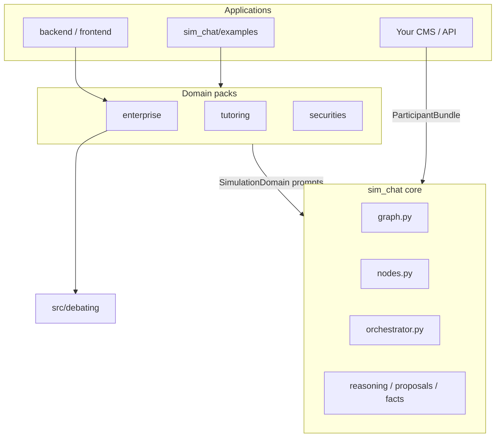
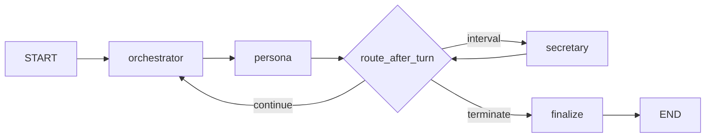
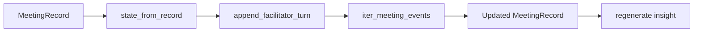

# Multi-Agent Simulation Engine — Architecture

LangGraph-based **multi-persona dialogue simulation**. Each participant is a **digital twin** driven by a system prompt, optional negotiation profile, and shared session state. The graph uses **centralized state** and a **Python-orchestrated speaker loop** (LLM assists selection; routing is not left to participants).

The engine is **domain-agnostic**: the same core runs corporate meetings, tutoring sessions, investment advisory panels, and other verticals via **domain packs** (`sim_chat/domains/`).

Related docs:

- Upgrade 1 (multi-stage reasoning): [`docs/IMPLEMENTATION_UPGRADE_1_PLAN.md`](../../docs/IMPLEMENTATION_UPGRADE_1_PLAN.md)
- Upgrade 2 (facilitator extension / resume): [`docs/IMPLEMENTATION_UPGRADE_2_PLAN.md`](../../docs/IMPLEMENTATION_UPGRADE_2_PLAN.md)
- Admin / meeting UI plan: [`docs/IMPLEMENTATION_PLAN.md`](../../docs/IMPLEMENTATION_PLAN.md)
- Quick start: [`../README.md`](../README.md)

---

## 1. System overview

| Layer | Role | Domain-specific? |
|-------|------|------------------|
| **`sim_chat/`** (core) | LangGraph engine: graph, nodes, state, stopping, SSE | No |
| **`sim_chat/domains/`** | Prompts, labels, role keywords, participant loaders | Yes — one pack per vertical |
| **`src/debating/`** | Enterprise data: persona/company markdown → prompts | Yes — `enterprise` domain only |
| **`backend/`** | FastAPI: meetings CRUD, simulation worker, chat, DB | Product layer (currently enterprise UI) |
| **`frontend/`** | React: meeting hub, transcript, proposals, persona admin | Product layer |



**Design principles**

- **Orchestrator-controlled flow** — participants do not route the graph themselves.
- **Public vs hidden** — only `DialogueTurn.content` is the public transcript; monologue and reasoning JSON stay in metadata unless `monologue_in_sse=True`.
- **Structured debate** — free-text chat is augmented by `working_proposals` and `shared_facts` on a shared blackboard.
- **Feature flags** — each pillar toggled via `MeetingConfig` without code changes.
- **Domain injection** — LLM system prompts for orchestrator, secretary, insight, reasoning, and fact extraction come from the active `SimulationDomain`, not hardcoded in nodes.

---

## 2. LangGraph topology

```
START
  → orchestrator     (pick next_speaker)
  → persona          (reason → speak → extract)
  → route_after_turn
       ├─ orchestrator   (continue)
       ├─ secretary      (consensus check)
       └─ end → finalize (set termination_reason)
  → END
```

Secretary also routes through `route_after_turn` (same three exits).



**Entry points**

| Function | File | Use |
|----------|------|-----|
| `build_meeting_graph()` | `graph.py` | Compile `StateGraph` |
| `run_meeting()` | `graph.py` | Synchronous full run → `MeetingRecord` |
| `iter_meeting_events()` | `graph.py` | SSE-friendly stream (backend simulation) |
| `create_initial_state()` | `bootstrap.py` | Load via domain registry or explicit personas |
| `create_initial_state_from_bundle()` | `bootstrap.py` | Start from `ParticipantBundle` (any app/DB) |

---

## 3. Persona node — three internal phases

Implemented in `nodes.py` → `make_persona_node`, with logic in `reasoning.py`, `proposals.py`, `facts.py`, and turn context in `context.py`.

```
┌─────────────────────────────────────────────────────────────────┐
│ PHASE A — REASON (hidden, optional 2nd LLM call)                │
│  • Build user context: transcript, matrix, proposals, facts     │
│  • Domain prompts: reasoning_system_suffix + reasoning_user     │
│  • LLM → JSON: absorb, compromise_space, stance_shift, …      │
├─────────────────────────────────────────────────────────────────┤
│ PHASE B — SPEAK (public)                                        │
│  • Domain speech_instructions template → 2–6 sentence utterance │
│  • Fallback: single LLM call if reasoning JSON parse fails      │
├─────────────────────────────────────────────────────────────────┤
│ PHASE C — EXTRACT (post-process, same node)                     │
│  • proposal_scores / new_proposal → working_proposals           │
│  • fact_acceptances + domain fact_extractor → shared_facts      │
│  • Dedup facts; cap lists; append DialogueTurn                  │
└─────────────────────────────────────────────────────────────────┘
```

**Context assembly** (`context.build_persona_user_context`, called from `nodes._build_user_context`)

- Session topic and labels from `SimulationDomain.labels` (e.g. "Cuộc họp" vs "Buổi học")
- Transcript window (`transcript.py`)
- Relationship matrix summary for current speaker
- Active `working_proposals` / colleagues' `shared_facts` when enabled

**Negotiation** — injected in reasoning via `build_reasoning_user_message()`. For enterprise, profiles and prompt blocks come from `src/debating/`; other domains supply `NegotiationProfile` in `ParticipantBundle` or use defaults from `participant_utils.build_negotiation_profiles()`.

---

## 4. Domain packs

**Registry:** `sim_chat/domain.py` — `register_domain()`, `get_domain()`, `load_domain_participants()`.

**Built-in packs** (`sim_chat/domains/`):

| `domain_id` | Label | Loader | Data source |
|-------------|-------|--------|-------------|
| `enterprise` | Cuộc họp nội bộ doanh nghiệp | `load_enterprise_participants` | `test_data/*.md` + `src/debating` (or backend DB via `create_initial_state(..., personas=...)`) |
| `tutoring` | Buổi học nhóm / gia sư | `load_tutoring_demo_participants` | In-memory demo (TUTOR, STUDENT_A, STUDENT_B) |
| `securities` | Tư vấn đầu tư chứng khoán | `load_securities_demo_participants` | In-memory demo (ADVISOR, ANALYST, RISK, COMPLIANCE) |

Each `SimulationDomain` defines:

| Field | Purpose |
|-------|---------|
| `labels` | Session nouns, transcript/relationship labels in turn prompts |
| `prompts` | orchestrator, secretary, insight, fact extractor, reasoning, speech templates |
| `topic_role_keywords` | Orchestrator heuristic: route topic to relevant role |
| `role_aliases` / `display_aliases` | Direct-address detection ("thầy" → TUTOR) |
| `default_factions` | Relationship matrix grouping |
| `default_opening_speaker` / `default_key_stakeholders` | Applied by `apply_domain_defaults()` when config fields empty |

**`ParticipantBundle`** — minimal input any application must provide:

```python
ParticipantBundle(
    participant_ids=["TUTOR", "STUDENT_A"],
    persona_names={"TUTOR": "Cô Lan", "STUDENT_A": "Minh"},
    system_prompts={"TUTOR": "...", "STUDENT_A": "..."},
    relationship_matrix=matrix,
    negotiation_profiles={},  # optional
)
```

### Starting a run

**Option A — registered domain loader:**

```python
from sim_chat import MeetingConfig, create_initial_state, run_meeting

config = MeetingConfig(
    domain_id="tutoring",
    meeting_topic="Phương trình bậc hai",
    max_turns=12,
    use_mock=True,
)
record = run_meeting(config)
```

**Option B — bring your own participants (CMS, DB, API):**

```python
from sim_chat import MeetingConfig, ParticipantBundle, create_initial_state_from_bundle, run_meeting

bundle = ParticipantBundle(...)  # built from your app
config = MeetingConfig(domain_id="tutoring", meeting_topic="Đạo hàm")
state = create_initial_state_from_bundle(config, bundle)
record = run_meeting(config, initial_state=state)
```

**Option C — enterprise product (current backend):**

Backend passes DB-built `system_prompts`, `persona_names`, and `personas` to `create_initial_state()`. Default `domain_id="enterprise"`. No change required for existing Vienovo deployments.

### Adding a new domain

1. Create `sim_chat/domains/my_app.py` — define `SimulationDomain` + optional `load_*_participants`.
2. Register in `sim_chat/domains/__init__.py` via `register_domain(...)`.
3. Set `MeetingConfig.domain_id = "my_app"` or pass `ParticipantBundle` directly.
4. Add tests in `sim_chat/tests/test_domain.py` (mock run with `use_mock=True`).

Core graph behaviour (conflict scoring, proposals, facts, stagnation) is unchanged; only prompts, labels, and role metadata differ.

---

## 5. Four upgrade pillars (implemented)

### 5.1 Internal monologue

| Item | Detail |
|------|--------|
| **Module** | `reasoning.py` |
| **Models** | `InternalMonologue`, `HiddenTurn`, `ReasoningResult` |
| **Flag** | `enable_internal_monologue` (default `True`) |
| **Prompts** | `domain.prompts.reasoning_system_suffix`, `reasoning_user_suffix`, `speech_instructions` |
| **Persist** | `metadata.hidden_turns`, `last_monologue` |
| **SSE** | `monologue` when `monologue_in_sse=True` |

Parse failure → single-shot speech fallback (no hidden turn recorded).

### 5.2 Negotiation profile

| Item | Detail |
|------|--------|
| **Model** | `NegotiationProfile` in `sim_chat/models.py` |
| **Enterprise** | `src/debating/negotiation.py`, persona metadata in PostgreSQL |
| **Fields** | `compromise_threshold`, `min_interest_retention`, `director_sensitivity`, `deadlock_tolerance` |
| **Dynamic** | `enable_dynamic_compromise` + `stagnation_score` |
| **Loader** | `participant_utils.build_negotiation_profiles()` |

### 5.3 Working proposals blackboard

| Item | Detail |
|------|--------|
| **Module** | `proposals.py` |
| **Flag** | `enable_working_proposals` (default `True`) |
| **Update** | After each turn via reasoning JSON |
| **Consensus** | `proposal_consensus_mode`: `secretary` \| `aggregate` \| `both` |
| **UI** | `MeetingSimulationTab` — proposals panel (enterprise product) |

State field **replaced in full** each turn (not `operator.add`).

### 5.4 Cross-agent shared facts

| Item | Detail |
|------|--------|
| **Module** | `facts.py`, dedup in `embeddings.py` |
| **Flag** | `enable_shared_facts` (default `True`) |
| **Extract** | Domain `fact_extractor_system` prompt + heuristic fallback |
| **Scope** | Episodic session memory — not vector RAG |

---

## 6. MeetingState schema

LangGraph `MeetingState` (`models.py`):

| Field | Reducer | Description |
|-------|---------|-------------|
| `messages` | `operator.add` | Public `DialogueTurn` list |
| `hidden_turns` | `operator.add` | Internal monologues |
| `working_proposals` | replace | Shared compromise proposals |
| `shared_facts` | replace | Cross-agent factual claims |
| `relationship_matrix` | replace | Conflicts, factions, optional astrology |
| `negotiation_profiles` | replace | Per-participant profiles |
| `config` | replace | Includes `domain_id` |
| `prompts`, `persona_names`, `participant_ids` | replace | Static for run |
| `terminated`, `termination_reason` | replace | Set in `finalize` |

---

## 7. Orchestrator

**File:** `orchestrator.py`

Hybrid selection:

1. **Direct address** — honour named participant (uses domain `role_aliases` / `display_aliases`).
2. **Conflict-first scoring** — affinity, conflict weight, faction opposition, domain `topic_role_keywords`.
3. **LLM fallback** — `domain.prompts.orchestrator_system`.

Uses `get_domain(state["config"].domain_id)` for prompts and keywords. Does **not** mutate proposals or facts.

---

## 8. Secretary, stopping, insight

**Secretary** (`nodes.make_secretary_node`) — `domain.prompts.secretary_system`; evaluates transcript + optional `working_proposals`. Returns `SecretaryVerdict`.

**Stopping** (`stopping.py`) — max rounds/turns, consensus (secretary + proposal aggregate), stagnation (multi-signal via `embeddings.py`).

**Insight** (`insight.py`) — post-run report using `domain.prompts.insight_system`.

**Private chat** (`private_chat.py`) — 1-1 Q&A after session; uses persona system prompt + full transcript + relationship matrix.

**Meeting extension (planned — Upgrade 2)** — facilitator injects a directive after `completed`; significance gate → hydrate `MeetingState` from `MeetingRecord` → resume graph. See **§17**.

---

## 9. MeetingConfig

**File:** `config.py`

| Group | Keys |
|-------|------|
| **Domain** | `domain_id` (default `"enterprise"`) |
| **Lifecycle** | `meeting_topic`, `max_rounds`, `max_turns`, `opening_speaker`, `participant_ids`, `key_stakeholders` |
| **Extension** | `enable_meeting_extension`, `extension_turn_budget`, `max_extensions_per_meeting`, `extension_stagnation_reset` |
| **Stopping** | `consensus_threshold`, `consensus_check_interval`, `stagnation_*`, `enable_consensus_check`, `enable_stagnation_check` |
| **Transcript** | `transcript_window_*`, `enable_rolling_summary`, `rolling_summary_*` |
| **LLM** | `llm_provider`, `llm_model`, `use_mock`, `reasoning_max_tokens`, `speech_max_tokens` |
| **Pillars** | `enable_internal_monologue`, `enable_working_proposals`, `enable_shared_facts`, `enable_dynamic_compromise`, … |

Empty `opening_speaker` / `key_stakeholders` → filled from domain defaults via `apply_domain_defaults()`.

Backend maps meeting row `config` JSON → `MeetingConfig` (`simulation_service._build_meeting_config`).

---

## 10. SSE event stream

**File:** `graph.py` → `iter_meeting_events`

| Event | When |
|-------|------|
| `started` | Graph begins |
| `turn` | New public `DialogueTurn` |
| `monologue` | New `HiddenTurn` if `monologue_in_sse` |
| `proposal_update` | `working_proposals` changed |
| `fact_update` | `shared_facts` changed |
| `secretary` | New verdict |
| `status` | `turn_index`, `loop_count`, `stagnation_score` |
| `completed` | Final `MeetingRecord` |
| `facilitator` | Facilitator turn appended before resume (planned) |

---

## 11. Module map

```
sim_chat/
├── domain.py              SimulationDomain, ParticipantBundle, registry
├── context.py             Domain-aware persona turn context
├── participant_utils.py   resolve IDs, negotiation profiles
├── config.py              MeetingConfig (+ domain_id)
├── models.py              Pydantic models + MeetingState
├── bootstrap.py           create_initial_state*, apply_domain_defaults
├── domains/
│   ├── __init__.py        register_builtin_domains()
│   ├── enterprise.py      Vienovo / corporate meeting pack
│   ├── tutoring.py        Tutoring demo pack
│   └── securities.py      Investment advisory demo pack
├── graph.py               StateGraph, run_meeting, SSE
├── nodes.py               orchestrator / persona / secretary / finalize
├── orchestrator.py        Speaker selection (heuristic + LLM)
├── reasoning.py           Monologue → speech (domain prompts)
├── proposals.py           Working proposals blackboard
├── facts.py               Shared facts (domain extractor prompt)
├── stopping.py            Termination + routing
├── embeddings.py          Stagnation + fact dedup
├── transcript.py          Context windows + rolling summary
├── relationship.py        Matrix build/filter (domain aliases)
├── llm.py                 OpenAI / Gemini / MockLLM
├── insight.py             Post-session report (domain prompt)
├── private_chat.py        1-1 follow-up chat
├── resume.py              state_from_record, prepare_extension_state
├── extension.py           significance classifier
├── persistence.py         MeetingRecord I/O
├── export.py              Export utilities
├── examples/              CLI runners
├── tests/                 62+ unit/integration tests
└── docs/
    └── architecture.md    (this file)

src/debating/              Enterprise vertical only
├── prompts.py             System prompt assembly
├── negotiation.py         NegotiationProfile defaults
├── loaders.py             Markdown → Persona / CompanyProfile
└── models.py

backend/app/services/      Current enterprise product
├── simulation_service.py
├── chat_service.py
├── persona_service.py
└── prompt_service.py
```

---

## 12. LLM call budget per persona turn

| Step | Calls | Skipped when |
|------|-------|--------------|
| Orchestrator | 0–1 | Conflict shortcut confident |
| Reason | 0–1 | `enable_internal_monologue=False` |
| Speak | 1 | Always (or only call if monologue off) |
| Fact extract | 0–1 | `enable_shared_facts=False` |
| Rolling summary | 0–1 | Interval not reached |
| Secretary | 0–1 | Every N turns on route |

Typical turn with all flags on: **2–3 calls** (reason + speak + fact extract).

---

## 13. Testing

```bash
python3 -m pytest sim_chat/tests/ -q
```

| File | Coverage |
|------|----------|
| `test_domain.py` | Domain registry, tutoring mock end-to-end |
| `test_reasoning.py` | JSON parse, speech generation, fallback |
| `test_negotiation.py` | Profiles, dynamic threshold |
| `test_proposals.py` | Merge, aggregate, consensus |
| `test_facts.py` | Extract, dedup, acceptances |
| `test_stagnation.py` | Stagnation signals |
| `test_orchestrator.py` | Speaker selection |
| `test_insight.py` | Insight assembly |
| `test_graph.py` | Full graph + SSE |

Dry-run without API keys: `MeetingConfig(use_mock=True)`.

---

## 14. Implementation status

| Capability | Status |
|------------|--------|
| LangGraph StateGraph + centralized state | Done |
| Multi-domain packs + ParticipantBundle API | Done |
| Orchestrator conflict-first selection | Done |
| Internal monologue (reason → speak) | Done |
| Negotiation profile per participant | Done |
| Working proposals blackboard | Done |
| Cross-agent shared facts | Done |
| SSE streaming | Done |
| Post-session insight + private chat | Done |
| Enterprise product (backend/frontend) | Done |
| Resume sim after completed (facilitator extension) | Phase A done — [`resume.py`](../sim_chat/resume.py), [`extension.py`](../sim_chat/extension.py); API/UI Phase B–C |
| `domain_id` in meeting wizard UI | Not yet — config JSON only |
| Vector RAG for persona KB | Out of scope |
| Dynamic matrix update each turn | Out of scope |

---

## 15. Local development

| Service | Default |
|---------|---------|
| Postgres | `localhost:5432/debating` |
| Backend | `uvicorn app.main:app --reload --port 8000` |
| Frontend | Vite `:5173`, proxies `/api` → backend |

After changing `sim_chat/`, restart the backend. Set `domain_id` and pillar flags in meeting `config` JSON.

---

## 16. Extension guidelines

- **New vertical** — add domain pack under `sim_chat/domains/`, register, test with `use_mock=True`.
- **New state fields** — use `operator.add` only for append-only logs (`messages`, `hidden_turns`); replace-in-place for mutable structures.
- **New LLM steps** — add `MeetingConfig` flag + domain prompt field + MockLLM branch.
- **Consensus** — keep secretary prompt and `check_consensus` in sync per domain.
- **Token pressure** — cap/summarize blackboard data before persona context injection.

---

## 17. Meeting extension & resume (Upgrade 2 — planned)

Allows a **human facilitator** (not a sim persona) to append a directive after the graph has reached `finalize`. If the message passes a **significance gate**, the same `MeetingRecord` is hydrated back into `MeetingState` and `iter_meeting_events()` runs again.

### 17.1 Position in product flow

```
Initial run:  START → … → finalize → completed → insight
Extension:    facilitator turn → significance? → resume graph → completed → insight (regenerated)
```

Distinct from:

- **Rerun** — discard transcript, cold start
- **Private chat** — 1-1, no group graph
- **Follow-up meeting** — new meeting row, new topic from insight

### 17.2 Facilitator turn

| Field | Value |
|-------|-------|
| `speaker_id` | `"FACILITATOR"` (not in `participant_ids`) |
| `speaker_name` | `"Người tổ chức"` (or domain label) |
| Placement | Appended to `messages` before graph resume |

`host_id` on the meeting row remains the **AI opening persona** (e.g. CEO). The real user acts only via `FACILITATOR` turns during extension.

### 17.3 Resume pipeline



**`state_from_record`** restores: `messages`, `working_proposals`, `shared_facts`, `relationship_matrix`, `turn_index`, counters; clears `terminated` / `termination_reason`.

**Extension budget:** `extension_turn_budget` caps new persona turns per extension; optional `max_extensions_per_meeting` at product layer.

### 17.4 Significance gate

Module: `extension.py` (planned).

LLM classifier returns `{ is_significant, reason, suggestion }`. Resume only when `is_significant` or user sets `force=true`.

| Accept | Reject |
|--------|--------|
| New budget / deadline / decision | Thanks, filler |
| Group-wide directive | Repeat of prior transcript |
| Changed success criteria | Better suited to private chat |

### 17.5 Orchestrator & persona changes

When `last_speaker == "FACILITATOR"`:

1. **Orchestrator** — prefer directly addressed participant; new `SpeakerSelectionMethod.FACILITATOR_DIRECTIVE`.
2. **Context** (`context.py`) — inject `## CHỈ ĐẠO TỪ NGƯỜI TỔ CHỨC` block for the next persona turn.

### 17.6 Stopping after resume

- `turn_index` continues from hydrated state.
- Effective max turns = prior count + `extension_turn_budget` (config copy for this run segment).
- Optional `extension_stagnation_reset`: zero `stagnation_score` so a fresh directive is not immediately killed by prior stagnation.

### 17.7 Persistence

Phase 1: audit in `MeetingRecord.metadata.extensions[]`:

```json
{
  "index": 1,
  "facilitator_content": "...",
  "significance_reason": "...",
  "forced": false,
  "turns_added": 6
}
```

Optional later: `meeting_extensions` DB table (migration `006`).

### 17.8 API & UI (product layer)

| Endpoint | Role |
|----------|------|
| `POST /meetings/:id/extend/evaluate` | Classifier preview |
| `POST /meetings/:id/extend` | Start resume + SSE |

UI: `FacilitatorComposer` on Simulation tab when `status === completed`.

Full task breakdown: [`docs/IMPLEMENTATION_UPGRADE_2_PLAN.md`](../../docs/IMPLEMENTATION_UPGRADE_2_PLAN.md).

---
