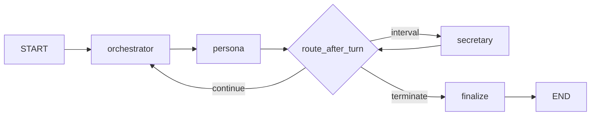

# Virtual Meeting Room — Architecture

LangGraph-based multi-persona meeting simulation. Each persona is a **digital twin** driven by a system prompt, negotiation profile, and shared meeting state. The graph uses a **centralized state** and a **Python-orchestrated speaker loop** (LLM assists selection; routing is not left to personas).

Related docs: product plan [`docs/IMPLEMENTATION_UPGRADE_1_PLAN.md`](../../docs/IMPLEMENTATION_UPGRADE_1_PLAN.md), admin/meeting UI [`docs/IMPLEMENTATION_PLAN.md`](../../docs/IMPLEMENTATION_PLAN.md).

---

## 1. System overview

| Layer | Role |
|-------|------|
| **`sim_chat/`** | LangGraph engine: graph, nodes, state, stopping, SSE streaming |
| **`src/debating/`** | Persona domain: prompts, loaders, negotiation defaults |
| **`backend/`** | FastAPI: meetings CRUD, simulation worker, chat sessions, DB |
| **`frontend/`** | React: meeting hub, live transcript, proposals panel, persona admin |

**Design principles**

- **Orchestrator-controlled flow** — personas do not route the graph themselves.
- **Public vs hidden** — only `DialogueTurn.content` is the public transcript; monologue and reasoning JSON stay in metadata unless `monologue_in_sse=True`.
- **Structured debate** — free-text chat is augmented by `working_proposals` and `shared_facts` on a shared blackboard.
- **Feature flags** — each upgrade pillar can be toggled via `MeetingConfig` without code changes.

---

## 2. LangGraph topology

```
START
  → orchestrator     (pick next_speaker)
  → persona          (reason → speak → extract)
  → route_after_turn
       ├─ orchestrator   (continue debate)
       ├─ secretary      (consensus check)
       └─ end → finalize (set termination_reason)
  → END
```

Secretary also routes through `route_after_turn` (same three exits).



**Entry points**

| Function | File | Use |
|----------|------|-----|
| `build_meeting_graph()` | `graph.py` | Compile `StateGraph` |
| `run_meeting()` | `graph.py` | Synchronous full run → `MeetingRecord` |
| `iter_meeting_events()` | `graph.py` | SSE-friendly stream (backend simulation) |
| `create_initial_state()` | `bootstrap.py` | Seed state from config + persona bundle |

---

## 3. Persona node — three internal phases

Implemented in `nodes.py` → `make_persona_node`, with logic split across `reasoning.py`, `proposals.py`, and `facts.py`.

```
┌─────────────────────────────────────────────────────────────────┐
│ PHASE A — REASON (hidden, optional 2nd LLM call)                │
│  • Build user context: transcript, matrix, proposals, facts   │
│  • LLM → JSON: absorb, compromise_space, stance_shift           │
│  • Optional: proposal_scores, new_proposal, fact_acceptances      │
├─────────────────────────────────────────────────────────────────┤
│ PHASE B — SPEAK (public)                                        │
│  • LLM → 2–6 sentence public speech ("Yes, and…")             │
│  • Fallback: single LLM call if reasoning JSON parse fails      │
├─────────────────────────────────────────────────────────────────┤
│ PHASE C — EXTRACT (post-process, same node)                     │
│  • Apply proposal_scores / new_proposal → working_proposals     │
│  • Apply fact_acceptances; extract speech → shared_facts        │
│  • Dedup facts (embeddings); cap lists                          │
│  • Append DialogueTurn; update stagnation + rolling summary     │
└─────────────────────────────────────────────────────────────────┘
```

**Context assembly** (`_build_user_context` in `nodes.py`)

- Meeting topic and transcript window (`transcript.py`)
- Relationship matrix summary for current speaker
- Active `working_proposals` (if enabled)
- Colleagues’ `shared_facts` excluding speaker’s own claims (if enabled)

**Negotiation** is injected in the reasoning step via `build_reasoning_user_message()` and in persona system prompts from `src/debating/prompts.py` (`# HỒ SƠ ĐÀM PHÁN` block). Profiles live in `MeetingState.negotiation_profiles`, loaded in `bootstrap.py` from persona metadata.

---

## 4. Four upgrade pillars (implemented)

### 4.1 Internal monologue (Phase 1)

| Item | Detail |
|------|--------|
| **Module** | `reasoning.py` |
| **Models** | `InternalMonologue`, `HiddenTurn`, `ReasoningResult` |
| **Flag** | `enable_internal_monologue` (default `True`) |
| **Flow** | Reason JSON → speech prompt with `[ABSORB]` / `[COMPROMISE SPACE]` |
| **Persist** | `metadata.hidden_turns`, `last_monologue` |
| **SSE** | `monologue` when `monologue_in_sse=True` |

Parse failure → fallback to legacy single-shot speech (no hidden turn recorded).

### 4.2 Negotiation profile (Phase 2)

| Item | Detail |
|------|--------|
| **Module** | `src/debating/negotiation.py`, `prompts.py`, `loaders.py` |
| **Model** | `NegotiationProfile` in `sim_chat/models.py` |
| **Storage** | PostgreSQL `personas.metadata.negotiation` (JSONB) |
| **Fields** | `compromise_threshold`, `min_interest_retention`, `director_sensitivity`, `deadlock_tolerance` |
| **Dynamic** | `enable_dynamic_compromise` raises effective threshold with `stagnation_score` |

Role defaults (e.g. CFO 0.25, CEO 0.70) applied at load time; editable in admin UI.

### 4.3 Shared blackboard — `working_proposals` (Phase 3)

| Item | Detail |
|------|--------|
| **Module** | `proposals.py` |
| **Models** | `WorkingProposal`, `ProposalApproval`, `ProposalScore`, `NewProposalDraft` |
| **Flag** | `enable_working_proposals` (default `True`) |
| **Update** | After each turn: score proposals in reasoning, add/refine proposals, recompute `aggregate_score`, cap at `max_active_proposals` |
| **Consensus** | `proposal_consensus_mode`: `secretary` \| `aggregate` \| `both` |
| **Secretary** | Sees proposals JSON; may declare consensus when aggregate ≥ threshold + stakeholder approval |
| **Persist / SSE** | `metadata.working_proposals`, SSE `proposal_update` |
| **UI** | `MeetingSimulationTab` — active proposals panel |

State field is **replaced in full** each persona turn (not `operator.add`), because approvals mutate in place.

### 4.4 Cross-agent facts — `shared_facts` (Phase 4)

| Item | Detail |
|------|--------|
| **Module** | `facts.py`, dedup in `embeddings.py` (`is_duplicate_fact`) |
| **Models** | `SharedFact`, `FactDraft`, `FactAcceptance` |
| **Flag** | `enable_shared_facts` (default `True`) |
| **Extract** | LLM fact extractor on public speech; heuristic fallback (`infer_facts_from_speech`) |
| **Dedup** | Bag-of-words cosine similarity ≥ `fact_dedup_similarity_threshold` |
| **Cap** | `max_shared_facts`, keeps newest by `turn_index` |
| **Reasoning** | `fact_acceptances` in reasoning JSON; injected block for colleagues’ facts |
| **Persist / SSE** | `metadata.shared_facts`, SSE `fact_update` |
| **UI** | `MeetingSimulationTab` — shared facts panel |

Episodic meeting memory only — not vector RAG / Pinecone.

---

## 5. MeetingState schema

LangGraph `MeetingState` (`models.py`):

| Field | Reducer | Description |
|-------|---------|-------------|
| `messages` | `operator.add` | Public `DialogueTurn` list |
| `hidden_turns` | `operator.add` | Internal monologues per turn |
| `working_proposals` | replace | Shared compromise proposals |
| `shared_facts` | replace | Cross-agent factual claims |
| `relationship_matrix` | replace | Conflicts, factions, optional astrology |
| `negotiation_profiles` | replace | Per-participant `NegotiationProfile` |
| `last_monologue` | replace | Latest monologue per `speaker_id` |
| `secretary_verdict` | replace | Last secretary JSON verdict |
| `transcript_summary` | replace | Rolling summary for long meetings |
| `current_speaker`, `last_speaker` | replace | Orchestration |
| `loop_count`, `turn_index`, `stagnation_score` | replace | Progress metrics |
| `turns_since_secretary` | replace | Secretary scheduling |
| `config`, `prompts`, `persona_names`, `participant_ids` | replace | Static for run |
| `terminated`, `termination_reason` | replace | Set in `finalize` |

---

## 6. Orchestrator

**File:** `orchestrator.py`

Hybrid selection:

1. **Direct address** — if last turn names a participant, honor it.
2. **Conflict-first scoring** — affinity, conflict weight, faction opposition, topic keywords.
3. **LLM fallback** — when heuristic gap is small; JSON `next_speaker`.

Uses truncated transcript (`transcript_window_orchestrator`) and relationship matrix. Does **not** mutate proposals or facts.

---

## 7. Stopping criteria

**File:** `stopping.py`

| Criterion | Function | Notes |
|-----------|----------|-------|
| Max rounds / turns | `check_max_rounds`, `check_max_turns` | `max_turns` overrides round-based limit |
| Consensus | `check_consensus` | Proposal aggregate and/or secretary verdict |
| Stagnation | `check_stagnation` | Multi-signal via `embeddings.compute_stagnation_signals` |

**Routing** (`route_after_turn`): evaluate termination first → else secretary every `consensus_check_interval` turns → else orchestrator.

**Stagnation signals** (`embeddings.py`): consecutive similarity, max similarity to prior turns, novel token ratio, substantive claim overlap (numbers, budget keywords, etc.).

---

## 8. Secretary node

**File:** `nodes.py` → `make_secretary_node`

LLM evaluates transcript (+ `working_proposals` JSON when enabled). Returns `SecretaryVerdict`:

- `consensus_score`, `has_consensus`, `key_stakeholder_approval`, `summary`

JSON parse failure → `heuristic_consensus()` keyword fallback.

When `proposal_consensus_mode` is `aggregate` or `both`, `check_proposal_consensus()` in `proposals.py` can terminate without secretary agreement on transcript alone.

---

## 9. MeetingConfig (feature flags & tunables)

**File:** `config.py`

Backend maps meeting row `config` JSON → `MeetingConfig` (unknown keys stripped in `simulation_service.py`).

| Group | Keys |
|-------|------|
| **Lifecycle** | `max_rounds`, `max_turns`, `opening_speaker`, `participant_ids`, `key_stakeholders` |
| **Stopping** | `consensus_threshold`, `consensus_check_interval`, `stagnation_*`, `enable_consensus_check`, `enable_stagnation_check` |
| **Transcript** | `transcript_window_*`, `enable_rolling_summary`, `rolling_summary_*` |
| **LLM** | `llm_provider`, `llm_model`, `use_mock`, `max_output_tokens`, `reasoning_max_tokens`, `speech_max_tokens` |
| **Pillar 1** | `enable_internal_monologue`, `monologue_in_sse` |
| **Pillar 2** | `enable_dynamic_compromise` (+ profiles in state, not config) |
| **Pillar 3** | `enable_working_proposals`, `proposal_consensus_mode`, `max_active_proposals` |
| **Pillar 4** | `enable_shared_facts`, `fact_extraction_min_confidence`, `max_shared_facts`, `fact_dedup_similarity_threshold` |

Disable a pillar → behavior reverts for that concern only (e.g. `enable_internal_monologue=False` → one LLM call per turn).

---

## 10. SSE event stream

**File:** `graph.py` → `iter_meeting_events`

| Event | When |
|-------|------|
| `started` | Graph begins |
| `turn` | New public `DialogueTurn` |
| `monologue` | New `HiddenTurn` if `monologue_in_sse` |
| `proposal_update` | `working_proposals` changed |
| `fact_update` | `shared_facts` changed |
| `secretary` | New verdict |
| `status` | `turn_index`, `loop_count`, `stagnation_score` |
| `completed` | Final `MeetingRecord` payload |

Frontend: `useMeetingStream.ts` handles `turn`, `proposal_update`, `fact_update`, `completed`, etc.

---

## 11. Persistence & artifacts

**`MeetingRecord`** (post-run):

| Field | Content |
|-------|---------|
| `messages` | Public transcript |
| `config` | Snapshot of run config |
| `relationship_matrix` | Matrix at end |
| `termination_reason` | `max_rounds` \| `consensus` \| `stagnation` \| `manual` |
| `insight_report` | Filled by `insight.generate_insight_report()` in backend |
| `metadata` | See below |

**`metadata` keys**

```json
{
  "participant_ids": ["CEO", "CFO", "..."],
  "secretary_verdict": { "...": "..." },
  "transcript_summary": "...",
  "summary_through_turn": 12,
  "hidden_turns": [ { "speaker_id", "turn_index", "monologue" } ],
  "working_proposals": [ { "id", "title", "aggregate_score", "approvals", ... } ],
  "shared_facts": [ { "id", "fact", "source_speaker_id", "turn_index", ... } ]
}
```

**Files:** `persistence.py` (load/save JSON records), `export.py` (batch export examples).

---

## 12. Post-simulation

### Insight report

**File:** `insight.py`

LLM strategic summary from transcript + termination context. Invoked by backend after graph completes.

### Private 1-1 chat

**File:** `private_chat.py`

`create_session_from_record()` builds an isolated session:

- Persona system prompt + full meeting transcript + relationship matrix (+ optional astrology)
- `PrivateChatSession.chat()` — user Q&A with persona about the meeting

Wired through `backend/app/services/chat_service.py` and meeting Chat tab.

---

## 13. Module map

```
sim_chat/
├── config.py           MeetingConfig
├── models.py           Pydantic models + MeetingState TypedDict
├── bootstrap.py        create_initial_state(), persona/prompt loading
├── graph.py            StateGraph compile, run_meeting, SSE iterator
├── nodes.py            orchestrator/persona/secretary/finalize nodes
├── orchestrator.py     Speaker selection (heuristic + LLM)
├── reasoning.py        Monologue prompts, JSON parse, generate_persona_speech
├── proposals.py        Working proposals blackboard
├── facts.py            Shared fact extract, dedup, context formatting
├── stopping.py         Termination checks + conditional routing
├── embeddings.py       Stagnation signals + fact dedup similarity
├── transcript.py       Context windows + rolling summary
├── relationship.py     Matrix helpers, role aliases
├── llm.py              OpenAI / Gemini / MockLLM providers
├── insight.py          Post-meeting insight report
├── private_chat.py     1-1 interrogation sessions
├── persistence.py      MeetingRecord I/O
├── export.py           Export utilities
├── examples/           CLI runners (conflict, long debate, stagnation)
├── tests/              Unit tests (42+ cases)
└── docs/
    └── architecture.md   (this file)

src/debating/
├── prompts.py          System prompt assembly (+ negotiation block)
├── negotiation.py      NegotiationProfile, role defaults, prompt formatting
├── loaders.py          Persona markdown → models + negotiation metadata
└── models.py           Domain persona types

backend/app/services/
├── simulation_service.py   Meeting run + SSE + insight
├── chat_service.py         Private chat sessions
├── persona_service.py      Negotiation in personas.metadata
└── prompt_service.py       Rebuild system prompts from DB
```

---

## 14. LLM call budget per persona turn

| Step | Calls | Skipped when |
|------|-------|--------------|
| Orchestrator | 0–1 | Heuristic shortcut confident |
| Reason | 0–1 | `enable_internal_monologue=False` |
| Speak | 1 | Always (or only call if monologue off) |
| Fact extract | 0–1 | `enable_shared_facts=False` |
| Rolling summary | 0–1 | Interval not reached |
| Secretary | 0–1 | Every N turns on route |

Typical turn with all flags on: **2–3 calls** (reason + speak + fact extract).

---

## 15. Testing

```bash
python3 -m pytest sim_chat/tests/ -q
```

| File | Coverage |
|------|----------|
| `test_reasoning.py` | JSON parse, speech generation, fallback |
| `test_negotiation.py` | Profiles, dynamic threshold, prompt block |
| `test_proposals.py` | Merge, aggregate, consensus, cap |
| `test_facts.py` | Extract, dedup, acceptances, context injection |
| `test_stagnation.py` | Stagnation signals |
| `test_orchestrator.py` | Speaker selection |
| `test_insight.py` | Insight prompt assembly |

Dry-run without API keys: `MeetingConfig(use_mock=True)` or backend `use_mock` provider.

---

## 16. Implementation status (vs original spec)

| Capability | Status |
|------------|--------|
| LangGraph StateGraph + centralized state | Done |
| Orchestrator (non-LLM-routed graph) | Done |
| Relationship matrix + optional astrology | Done |
| Stagnation (embedding-like similarity) | Done |
| Secretary consensus sub-agent | Done |
| Internal monologue (reason → speak) | Done |
| Negotiation profile per persona | Done |
| Working proposals blackboard | Done |
| Cross-agent shared facts | Done |
| SSE streaming to frontend | Done |
| Proposals UI panel | Done |
| Facts UI panel | Done |
| Post-meeting insight | Done |
| Private 1-1 chat | Done |
| Vector RAG for persona KB | Out of scope |
| Dynamic matrix update each turn | Out of scope |

---

## 17. Local development

| Service | Default |
|---------|---------|
| Postgres | `localhost:5432/debating` (Docker Compose) |
| Backend | `uvicorn app.main:app --reload --port 8000` |
| Frontend | Vite `:5173`, proxies `/api` → backend |

After changing `sim_chat/`, restart the backend. Meeting config JSON on each meeting row controls pillar flags for that run.

---

## 18. Extension guidelines

- **New state fields** — prefer replace-in-place patches from nodes when mutating nested structures; use `operator.add` only for append-only logs (`messages`, `hidden_turns`).
- **New LLM steps** — add feature flags to `MeetingConfig`; provide MockLLM branch in `llm.py` for tests.
- **Consensus** — extend `check_consensus` and secretary prompt together to avoid divergent termination behavior.
- **Token pressure** — cap and summarize `working_proposals` / `shared_facts` before injecting into persona context; reuse `transcript.py` rolling summary pattern for long meetings.
